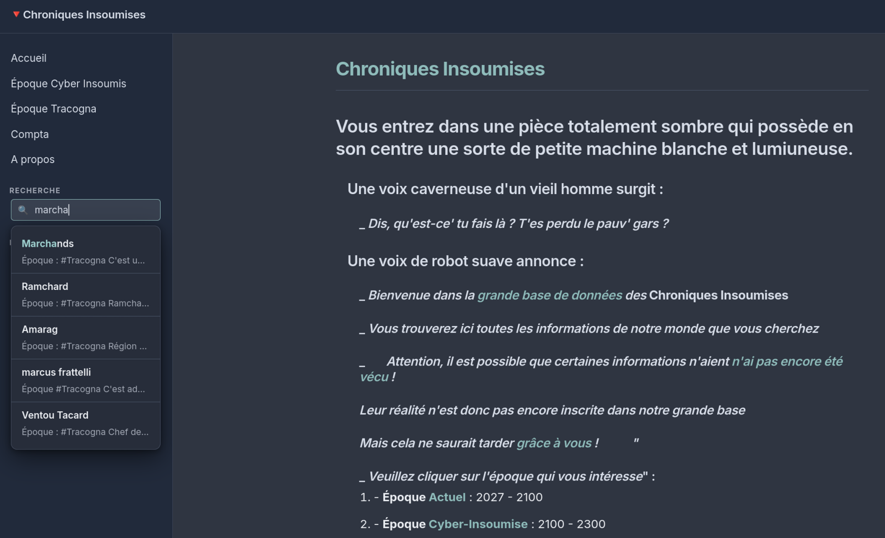

# 🧱 logseq-site-builder

Turns a [Logseq](https://logseq.com/) graph into a static website — HTML + CSS + vanilla JS, no server, no build framework.

> 🤖 **Vibecoded** — entirely generated through vibe coding with Claude. Readable and hackable, but still **early beta**: expect rough edges and breaking changes.

## Example

[chroniques-insoumises.com](https://chroniques-insoumises.com/) — a Logseq knowledge base built with the default theme.



## Features

- **Org & Markdown** pages, converted via Pandoc
- **Selective publishing** — `#+PUBLIC: true` per page, an all-public mode, or hide specific paths
- **Wiki links, images & attachments** handled automatically (`[[Page]]`, `[[../assets/file.pdf]]`…)
- **Blog / journals** — index page + RSS feed generated from your Logseq journals
- **Themes** — built-in `default` and `dark`, or bring your own CSS
- **Nav menu & social links**, configurable via TOML
- **Custom HTML/CSS pages** copied as-is (embeds, mini-apps, slide decks…)
- **External static sites** — copy in mini-sites that live outside the project (`[[external_static_dirs]]`)
- **Full-text search**, client-side (Fuse.js), no server needed
- `--check-links` to catch broken wiki links before they 404
- `--check-assets` to list assets that no page references
- `--zip` to archive the built site

## Requirements

- Python 3.11+
- [pandoc](https://pandoc.org/installing.html)

## Install

```bash
git clone https://github.com/thomas-louvigne/logseq-site-builder.git
cd logseq-site-builder
python -m venv .venv
source .venv/bin/activate   # .venv\Scripts\activate on Windows
pip install -e .
```

## Usage

```bash
logseq-builder ~/my-logseq ~/Sites/my-site
```

On first run, a `logseq-site-builder.toml` is generated at the root of your Logseq project (pre-filled from `logseq/config.edn`). Edit it to set the title, theme, nav menu, blog, RSS, etc. — see [`logseq-site-builder.example.toml`](logseq-site-builder.example.toml) for every option, documented.

Priority: CLI options > TOML file > `logseq/config.edn`.

### Options

| Option | Description |
|---|---|
| `--site-title TEXT` | Site title (default: directory name) |
| `--home-page SLUG` | Page to use as `index.html` |
| `--all-public` | Publish all pages, ignore `#+PUBLIC` |
| `--social NAME:URL` | Social link in the nav menu (repeatable) |
| `--theme NAME_OR_PATH` | `default`, `dark`, or a path to a CSS file |
| `--check-links` | List internal links that would 404 |
| `--check-assets` | List assets that no page references |
| `--zip` | Zip the built site into `<output_dir>.zip` |
| `--no-init-toml` | Skip generating the TOML on first run |

### Preview locally

```bash
cd ~/Sites/my-site
python3 -m http.server 8080
```

## Tests

```bash
pip install -e ".[dev]"
python3 -m pytest
```
